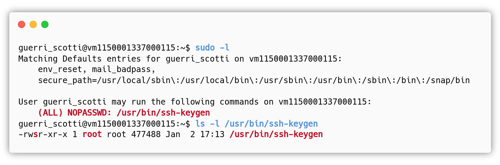
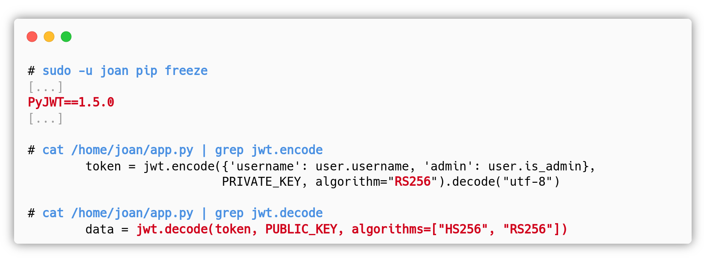

# Designing and Configuring a Vulnerable VM

## Group 1

**[Emanuele 'cats' Gatto](https://it.linkedin.com/in/emanuele-gatto-0a0a2b243)** and I completed this laboratory assignment. 

You can [download our VM](https://drive.google.com/file/d/1ZK-QA6WqeTbcij9LnOVhukcrWuGxNqvU/view?usp=sharing) and smash it before reading the writeup. Link will be available for a couple years.

## Requirements

1. **VM Design**: You will design a virtual machine (VM) containing deliberate vulnerabilities. This VM must provide some ways for pentesters to first obtain remote access (e.g., through a vulnerable service) and successively escalate privileges (obtain root).

2. **VM Report**: Create a written report documenting the following:
    - *Vulnerable Services and Programs*: Detail the specific vulnerabilities you introduced into the VM.
    - *Attack Path Scenario*: Explain your vision for how a penetration tester could gain root access to your VM. This includes outlining the vulnerabilities they might exploit, and the likely steps involved in escalating privileges.

The VM will be based on Ubuntu Server 20.04 LTS 64-bit and must work with VirtualBox.
- Your VM must provide 3 different paths to obtain local access (easy, intermediate, hard), and 3 different paths to escalate privileges (easy, intermediate, hard).
User-written vulnerable programs, if used, must satisfy the following criteria:
- Source code must be available and placed in a directory in the VM that is accessible as a non-root user. No code obfuscation should be used.
- If the vulnerability to be exploited is a buffer overflow, the buffer overflow protections that would make the exploit impossible must be permanently disabled. *Since we saw some techniques to bypass security mitigations in class, this rule was removed, but all the memory corruption vulnerabilities should be in the hard path*.

> SPOILER ALERT: The next sections contain useful information to solve our VM.
{: .prompt-danger }

# VM configuration

All the services are configured, enabled and started with **systemd**, the machine uses DHCP to get an IPv4 address, the box should have a bridged network interface. We inclued a backdoored troll **vsftpd 2.3.4** service that the attacker can exploit **without** getting a shell. It can be used for persistence when they will get root :). 

## Exploitation paths

This is a graph of the exploitation paths, it will be much clearer after reading the details in the next sections. Use it as reference.

## Easy exploitation path

### Foothold: Werkzeug Debug Unprotected Console

#### Idea

The easy exploitation path requires the presence of a vulnerability that could immediately give the attacker a shell and we had many ways to introduce a RCE. We opted for a simple Flask web application running in debug mode, which opens up the `/console`{:.filepath} path that allows the developer to use a Python interpreter. This alone is not a security problem because the page is protected by a PIN, but it is risky and wrong to have it in a production environment, also because you just need a path traversal / local file inclusion vulnerability to be able to collect all the informations to generate the right PIN and access the console. In this case, the developer was so tired of writing the PIN at every server restart that he decided to add the environment variable `WERKZEUG_DEBUG_PIN=off` that completely disables the PIN, but forgot to change the listening IP address to **127.0.0.1**. This way a potential remote attacker or, as in this case, someone in the same local network could get a shell in the same context of the Flask web app. 

#### Detection

By normally using the web application running on port **4444** there is no way to know that the application is running in debug mode, the application does not have links pointing to the `/console`{:.filepath} path, in fact it is something that is added by the underlying Werkzeug web server.

This vulnerability can be detected in two ways: with directory enumeration (scanning) and with knowledge.

It is a good practice to always check for the `/console`{:.filepath} path when reading the following `Server` header:

{: width="500"}

In case the attacker didn't notice, it is also possible to detect the vulnerable path with a directory enumeration:

{: width="650"}

In any case the attacker will land on the page below:

{: width="800"}

#### Exploitation

It is now possible to use the python interpreter to execute system commands in the context of the Flask web application. We can either use the Werkzeug debug console to send commands or, better, get a reverse shell. In the following screenshot we demonstrate both ways:

{: width="800"}

#### Remediation

To fix this vulnerability the developer can:

1. Remove the environment variable `WERKZEUG_DEBUG_PIN=off` to re-enable the PIN, which is more secure, but not enough considering that there are other vulnerable services / applications running on the same machine.
2. Set the loopback interface as the only iface that can be used to reach the application, i.e. in the `app.py`{:.filepath} file set **127.0.0.1** or **localhost** instead of **0.0.0.0**, which reduces the attack surface, but again, it's not enough.
3. Use the Flask debugging environment for the minimum amount of time possible.
4. Fix the rest of the VM to safely use the debug mode. 

### Privesc: SUID ssh-keygen NOPASSWD

#### Idea

Once the attacker got its initial access through the remote code execution on the HTTP service running on port **4444**, he/she can get a shell as the user `guerri_scotti`. Since this is the easiest path, we introduced a common misconfiguration that can be found in poorly administered Unix systems: a legitimate Unix binary which can be abused to escalate privileges, transfer files, break out of restricted shells, and facilitate other post-exploitation activities. These are commonly referred as **GTFOBins**[[1]](#references){: .footnote} or Living Off the Land (LOL) Binaries because they are usually already present in the system and do not require the attacker to upload backdoors or other scripts when these are found misconfigured. In this case we have chosen the `ssh-keygen` utility that can be run as `root` because of its ownership and the SUID bit set, moreover it can be used without inserting the root password because of the `NOPASSWD` "instruction" written on the `/etc/sudoers`{:.filepath} file. We think that this is an easy binary to exploit because of the huge amout of documentation that can be found on the web and because of the beautiful laboratory lesson on Shared Object Injection that covered everything you need to know to perform this privilege escalation. 

To support the previous statement, here are some resources of the web that can help on the construction of the exploit:

- GTFOBins ssh-keygen [[2]](#references){: .footnote}
- HackTricks SO Injection [[3]](#references){: .footnote}
- Seanpesce - Leveraging ssh-keygen for arbitrary execution [[4]](#references){: .footnote}

#### Detection

To detect this misconfiguration the attacker just need to run `sudo -l`:

{: width="800"}

#### Exploitation

The exploitation of this vulnerability requires the creation of a shared object that can be used to execute any system command as root, leveraging the `-D pkcs11` argument which normally seeks for public keys in the shared library `pkcs11` provided by the user. The attacker can maliciously craft the shared object in its system and serve it via http:

{: width="800"}

The above is necessary because `gcc` is not installed in the VM, this way we force the attacker to do a file transfer.

{: width="800"}

### Remediation

To fix this vulnerability the root user should edit the `/etc/sudoers`{:.filepath} file and remove the following line:

- `guerri_scotti ALL=(ALL) NOPASSWD: /usr/bin/ssh-keygen`

There is no need to allow the user `guerri_scotti` to run that binary as root, especially without providing the password. As we can see from the detection paragraph, every user can already launch the `ssh-keygen` utility to generate personal keys without the need to be an administrator.

## Medium exploitation path

For the medium exploitation path, obtaining a shell should be a little bit more challenging than before. This time the vulnerable service is running on port **1337** and it's a Flask web application of a blog. 

- The unauthenticated user can register, login, read blog posts and their comments. 
- The authenticated unprivileged user can add comments to existing blog posts.
- The authenticated administrative user can add blog posts, access a dashboard with statistics of the website and of the users.

Some functionalities are there just to add some features, because otherwise it would be trivial for the attacker to find the vulnerability if there were a single web page. 

### Foothold (part 1): CVE-2017-11424 PyJWT v1.5.0 Algorithm Confusion

#### Idea

We introduced a vulnerability that was discussed during the laboratory lessons for which we haven't seen an attack: the JWT algorithm confusion. Usually developers use libraries to handle JWTs and the functions they use generally have some controls to avoid the classic `alg: "None"` issue or prevent the application from using a public key with symmetric encryption, i.e. `alg: "HS256"`. This was not always the case, we installed PyJWT v1.5.0 which has **CVE-2017-11424**[[5]](#references){: .footnote} assigned: the library allows the developer to use `HS256` with a PKCS1 PEM encoded RSA public key as secret! Here is the commit that fixes the vulnerability, useful to understand the security problem:

- Fix commit for PyJWT v1.5.1[[6]](#references){: .footnote}. Expand down the `jwt/algorithms.py`{:.filepath} diff once, to see how the `invalid_strings` array is used. 

Every year new attacks or new vulnerabilities are discovered on JWT implementations. We think it's a nice medium vulnerability because the attack is quite easy but we haven't seen how to do it in classes, a little bit of research on the web is needed.

#### Detection

There is no way to detect this vulnerability from the outside, but usually when an attacker sees that the application is using JWT, he/she should try all the possible attacks. There are many tools available in the web that try different techniques. 

If the attacker got root with an alternative exploitation path, he/she can run `sudo -u joan pip freeze`, where `joan` is the user running the Flask app, and find the version of PyJWT. The root user can also read the source code and the RSA private key to sign any token, but this is not the intended path.

{: width="800"}

The website logo is the JWT image, as an hint. 

#### Exploitation

We would like to discuss about the realism of our specific scenario in this section. In a real world application, the attacker does not have access to the public key used to verify JWTs because developers do not use the same public key of the SSL certificate for HTTPS, but a different key pair. Therefore, the exploitation of this vulnerability would be harder, but still possible. 

We decided to simplify things up and give the attacker the access to the RSA public key thanks to an information leakage in the `/login`{:.filepath} HTML source containing a very wrong comment:

{: width="800"}

By sending a HTTP GET request to `/api/auth/get_pubkey`{:.filepath} you will receive the following JSON:

{: width="750"}

The exploitation can be performed in three ways, presended in order of ascending complexity.

**Publicly available tools**: there are many tools that can be used to craft an admin token, the simplest one is *Token.dev* website[[7]](#references){: .footnote}, also suggested in different web articles on JWT attacks, for which we provide a screenshot of its usage. The token in the screenshot is valid.

{: width="750"}

**Personal exploit, using the public key**: the attacker can write its own exploit, for example with PyJWT v1.5.0 or with the newest version after reverting the fix of the library that you can find in the Idea paragraph. We used the latest version of PyJWT and edited `jwt/algorithms.py`{:.filepath} and `jwt/utils.py`{:.filepath} in the attacker machine running the following exploit:

{: width="750"}

**Real exploit**: as we explained at the beginning of the Exploitation paragraph, it is also possible to craft a valid token without having the public key. In order to do so, the attacker should create two accounts, login with both and collect the two JWTs, then compute the GCD on the signatures to get the modulus $n$ of RSA. The exploit works if the attacker is able to guess the public exponent $e$, which usually is $65537$. Here is a working exploit[[8]](#references){: .footnote} for our VM. An alternative exploit can be found in Silentsignal's rsa_sign2n Github repo[[9]](#references){: .footnote}.

#### Remediation

1. To fix this vulnerability, the web application should specify a single algorithm that is used to both verify the signature and to sign the token. In this case, the developer should either use `HS256` or `RS256`, but not both. If the `jwt.encode()` function uses `RS256`, then the `jwt.decode()` function should only use `RS256`. This fix alone is enough to prevent the attacks above.
2. PyJWT v1.5.0 is also vulnerable to **CVE-2022-29217**, but this web application is not affected because the `jwt.encode()` and the `jwt.decode()` functions explicitly specify the allowed algorithm. However, it is risky to use a vulnerable dependency, so the developer should upgrade PyJWT to the latest version.

### Foothold (part 2): SQL Injection in /admin/stats/user_id/

#### Idea

After the attacker successfully crafted an administrative JWT, it can access more functionalities in the web application. The goal is to get a shell on the machine and so we decided to include an Error-based SQL Injection that enables the attacker to get some credentials that he/she can use on the SSH service. To make this vulnerability more real, passwords are encrypted with the strong hashing algorithm Blowfish (bcrypt), so the hash cracking process is slow and simulates the real pain the attacker face in real world scenarios. We added a disclaimer in the `/etc/issue`{:.filepath} that warns the students to not kill their favourite hash cracking tool just because it doesn't give results instantly. 

The password of the administrative user `joan` is in Seclists' `xato-net-10-million-passwords-1000000.txt`{:.filepath} wordlist, which is smaller compared to the popular `rockyou.txt`{:.filepath}.

#### Detection

The attacker can detect the Error-based SQL Injection by tampering with the `user_id` parameter of the `/admin/stats/user_id/`{:.filepath} endpoint:

{: width="500"}
{: width="500"}

#### Exploitation

To extract informations from the DB, the attacker will execute the following Union-based queries:

1. Find the correct number of fields in the original query by using multiple `null` values. The `user_id` parameter will be `2 UNION SELECT null,null,null,null; -- -`
2. Find which field is printed on the web page: `2 UNION SELECT null,'PRINTED',null,null; -- -`
3. Find which DBMS the application is using: `2 UNION SELECT null,sqlite_version(),null,null; -- -`
4. Find the name of the tables in the current DB: 
     - `2 UNION SELECT null,name,null,null FROM sqlite_master WHERE type='table'; -- -`
     - `2 UNION SELECT null,name,null,null FROM sqlite_master WHERE type='table' AND name <> 'blog_post'; -- -`
     - `2 UNION SELECT null,name,null,null FROM sqlite_master WHERE type='table' AND name <> 'blog_post' AND name <> 'comment'; -- -`
5. Find the column names for the `user` table: 
     - `2 UNION SELECT null,name,null,null FROM pragma_table_info('user');`
     - `2 UNION SELECT null,name,null,null FROM pragma_table_info('user') WHERE cid = 1;`
     - `2 UNION SELECT null,name,null,null FROM pragma_table_info('user') WHERE cid = 2;`
     - `2 UNION SELECT null,name,null,null FROM pragma_table_info('user') WHERE cid = 3;`
6. Get username and password of the administrative user: 
     - `2 UNION SELECT null,username||':'||password,null,null FROM user WHERE is_admin = 1;`
7. Get username and password of other users:
     - `2 UNION SELECT null,username||':'||password,null,null FROM user WHERE ID = 3;`
     - `2 UNION SELECT null,username||':'||password,null,null FROM user WHERE ID = 4;`

Once the attacker gets the bcrypt hash of the administrative user, he/she can run `hashcat` to crack it:

{: width="700"}

**Password cracking time analysis**: 

- Going through the whole 1 million passwords wordlist takes about 8 hours on Boge's PC without GPU, at 50 H/s cracking speed. The `cipher1` password is at 1/3 of the wordlist, so after about 2 hours and a half the attacker should have the plain text password. *It is easy to have better hardware and faster cracking speeds.*
- Going through the whole 1 million passwords wordlist takes about 23 minutes on Cats's PC with GPU support, at 650 H/s cracking speed.

#### Remediation

If we take a look at the source code, this is the only place where the developer stopped using SQLAlchemy's prepared statements and wrote a SQL query where the user input is appended:  

{: width="600"}

The developer should replace the dangerous query with the secure SQLAlchemy's prepared statement `user = User.query.filter_by(id=user_id).first()`.

> **Unintended foothold**: Bruteforce of credentials thanks to unlimited login attempts.
{: .prompt-info }

### Privesc: AES key generation with srand(time(NULL)) and rand()

#### Idea

We were searching for some ways to escalate privileges on Linux, but we could not find something relatively easy to do that was not already fully covered by resources such as HackTricks[[10]](#references){: .footnote}. For this reason, for the next privilege escalations we decided to create custom binaries.

In this exploitation path we created a binary which includes a vulnerability in the class *CWE-338: Use of Cryptographically Weak Pseudo-Random Number Generator (PRNG)*[[11]](#references){: .footnote}. The program uses AES, the secure symmetric cryptographic algorithm, but it improperly generate its key with random numbers seeded with `srand(time(NULL))`. This cipher is then used to encrypt sensitive informations such as root's OpenSSH private key. 
Why would an unprivileged user be able to encrypt such an important file? Because we set up a story in which the root user goes in holiday and trusts `joan` to work on his behalf in case of emergency. This is not 100% realistic, but we need a way to get a shell. The user `joan` knows the importance of root's private key and encrypts it with that broken binary. 

This is the simplest form of Weak PRNG, but we think it's a medium vulnerability considering that we have not seen something like this in the lectures. The students will have to understand the few lines of code and develop an exploit (ChatGPT is able to do that). We also think that the vulnerability can be found on real systems, maybe not in this specific scenario: to support this statement, here is a *vulnerability list that falls in CWE-338*[[12]](#references){: .footnote}. 

In the source code we are using AES-ECB-128 for simplicity, we are aware of the potential security problems that the ECB mode introduces but they are not of interest in our scenario. 

This same vulnerability (without AES, but with password generation) was found by **Joe 'Kingpin' Grand** and **Bruno** in the RoboForm software to recover a Bitcoin wallet worth three million dollars: 

- [https://www.youtube.com/watch?v=o5IySpAkThg](https://www.youtube.com/watch?v=o5IySpAkThg)

#### Detection

The attacker logs in as `joan` and sees that there is an email:

{: width="600"}

The attacker can read it in `/var/mail/joan`{:.filepath}:

{: width="800"}

In `joan`'s home, the attacker will find the executable `encryptor` and its C source:

{: width="500"}

Moreover with some file system enumeration, he/she will find that in the directory `/home/joan/.ssh/`{:.filepath} there is a file named `id_rsa.enc`{:.filepath}, where the extension `.enc`{:.filepath} suggests that it's an encrypted file. Executing a simple `ls -l` the attacker will notice that the last modification of the file `id_rsa.enc`{:.filepath} is: **Jun 19 2006**, suggesting that the file was encrypted in that day.

#### Exploitation

There are two ways to exploit this vulnerability: the naive apporoach and the fast approach. Both of these ways require the attacker to write the decryption function, which can also be easily found on the web (or some variant).

**Fast approach**: The attacker may just look at the last modification of the file (19 Jun 2006), and use the command: `date -r id_rsa.enc +%s`, to find out the exact unix timestamp of the last modification, that is the seed used for the generation of the key. Another equivalent way would be to use the command: `stat -c ‘%y’ id_rsa.enc` to have the year, month, day, hour, minute and second of the last modification, then the attacker could use an online utility to convert it into a unix timestamp.

{: width="700"}

The exploit in C should be something like this:

{: width="800"}

**Naive approach**: Once the attacker understands that he/she can take advantage of the key generation method, he/she can start to brute force all the keys, generating them by seeding the `srand()` function with the unix timestamps starting from the morning of the 19 Jun 2006. The modified C exploit should be:

{: width="800"}

The attacker can then open the output file with `less` and search for the `BEGIN` string.

#### Remediation

This vulnerability can be easily fixed by generating the key using a Cryptographically Secure Pseudo Random Number Generator (CSPRNG), such as the C function: `int RAND_bytes(unsigned char *buf, int num)` of the library `openssl/rand.h` (we didn't check if it's secure :)). We can then modify the C source code to print out the key bytes once the file is encrypted, this way the owner of the file will be able to decrypt the file in the future.

## Hard exploitation path

### Foothold (part 1): CVE-2024-23897 Jenkins LTS 2.426.2 Arbitrary File Read through jenkins-cli

#### Idea

In March 2024 we started working on the VM and we decided to include some recent real vulnerabilities. Since this is the hard exploitation path, we should chain some attacks in order to get the initial shell. 

We first included the **CVE-2024-23897: Arbitrary File Read through jenkins-cli**[[13]](#references){: .footnote} on Jenkins LTS 2.426.2 running on port **8080**, but then we discovered that there was already a retired medium HTB machine called *Builder*[[14]](#references){: .footnote} with public writeups that had the same configuration. To avoid having the same scenario, we decided to change the default configuration of Jenkins, using the popular **Role-Based Access Strategy** plugin to prevent the attacker from continuing the exploitation on this service. The attacker will have access to an account with guest-like privileges.

We think this is an easy vulnerability considering that public fully automated exploits are available. The manual exploitation just requires knowing the Jenkins' directory structure.

#### Detection

The detection is as easy as visiting the http service on port **8080** - that the attacker should have seen in the Footprinting & Scanning phase of the penetration test - and searching the version of Jenkins on the web.

{: width="800"}

#### Exploitation

The exploitation can be performed with publicly available tools, but we like getting our hands dirty so we will show the manual exploitation. Once the attacker understands that this deployment of Jenkins is vulnerable to CVE-2024-23897, he/she can download the **jenkins-cli.jar** utility directly from the service and start using it to read arbitrary files for which Jenkins has the permission.

{: width="750"}

The attacker can proceed to obtain the password hashes for all the Jenkins accounts and he/she has to follow these steps:

1. Discover where Jenkins is installed, the attacker can search on the web some default installation paths: `java -jar jenkins-cli.jar -s 'http://192.168.1.104:8080' connect-node "@/var/lib/jenkins/config.xml"` 
2. Find the users of the application: `java -jar jenkins-cli.jar -s 'http://192.168.1.104:8080' connect-node "@/var/lib/jenkins/users/users.xml"`
3. Read the password hash of the users, the interesting one is `oldadmin`: `java -jar jenkins-cli.jar -s 'http://192.168.1.104:8080' connect-node "@/var/lib/jenkins/users/oldadmin_8934789694270900868/config.xml`

Once the attacker gets the bcrypt password hash for the `oldadmin` user, he/she can try to crack it with `hashcat`, the process is the same as for the SQL Injection of the medium exploitation path. The password is `valeilpensiero`.

{: width="700"}

#### Remediation

The developer should consider the warning messages that appear in the Jenkins dashboard and update the software:

{: width="700"}

### Foothold (part 2): CVE-2024-2044 PgAdmin4 8.3 Authenticated RCE via Path Traversal and Unsafe Deserialization

#### Idea

The next vulnerability for the hard exploitation path is **CVE-2024-2044: Authenticated RCE on PgAdmin4 8.3**[[15]](#references){: .footnote}, with the Apache2 service listening on the loopback interface **127.0.0.1** and port **80**. The idea is that the attacker can read the credentials of an account in Jenkins through CVE-2024-23897, perform SSH local port forwarding (thanks to the previous exploitation paths) to be able to access the PgAdmin4 web service - this operation is pretty common on HTB machines - reuse the credentials obtained before to access the admin panel and get a reverse shell as `freeolo` with CVE-2024-2044 (to simplify, the PgAdmin4 service is runned by a user instead of the classic `www-data`). 

The attacker won't see this service with `nmap` because it's only listening on the loopback interface, so some enumeration is needed. The exploitation is easy when you are able to reach the pgAdmin4 web app, thanks to the public exploits available.

#### Detection

The detection of this vulnerability is possible in the Post-Exploitation phase of previous paths:

{: width="750"}

The attacker can now perform a SSH local port forwarding and reach the PgAdmin4 web interface via localhost. When you do a HTTP GET request to the `/`{:.filepath} path, a redirect to the login page will happen:

{: width="700"}

In PgAdmin4 users have to login with the email. The domain name is disclosed in the `robots.txt` file that can be found with directory enumeration.

{: width="700"}

After logging in, the attacker can check the version of the software with the Web GUI and search the web for known vulnerabilities:

{: width="500"}

#### Exploitation

The exploitation can be done following *[Shielder's advisory]*[[15]](#references){: .footnote}. We used their PoC to generate the `posix.pickle` that we will upload on the Storage Manager.

{: width="700"}
{: width="650"}

In pgAdmin4, session files are saved as pickle objects and when a user performs a request, the value of the session cookie `pga4_session` is used to retrieve the file, then it’s content is deserialized, and finally its signature is verified. The `cookie` is split in two parts at the first `!` where the first part is the session ID (`sid`, the filename) and the second is the digest. Thanks to the path traversal we can set as `sid` any arbitrary path, in this case we can use the uploaded pickle object that will be unsafely deserialized and will give us a reverse shell. The digest part can be anything since the deserialization and the code execution happen before its check.

{: width="750"}

#### Remediation

The developer should upgrade the software to the latest version.

### Privesc: Integer Overflow + Stack Buffer Overflow in custom SUID binary 'notebook'

#### Idea

With the pgAdmin4 8.3 authenticated RCE the attacker got a shell as `freeolo` and the privilege escalation is the real challenge of the hard exploitation path. In `freeolo`s home directory the attacker can find a custom binary "`notebook`" owned by root with the SUID bit set that is vulnerable to a Stack Buffer Overflow, a common memory corruption vulnerability. This is a simple program that can be used to jot down job-related notes. We decided to introduce this vulnerability because we both really enjoy the art of binary exploitation, and we think this is an hard exercise because, as we already mentioned at the beginning of the report, we do not know in what details we will cover the binary exploitation techniques in the laboratory classes. 
This kind of vulnerable program is common in a real world scenario, think about a programmer that writes thousands of lines of codes a day: he/she might just make a single small mistake that can let an attacker corrupt the memory, for example making a wrong cast or checking poorly for the size of a buffer. This same vulnerable binary is running on port **6969**, giving the attacker the possibility to use powerful toys like **IDA** and **pwntools** for the exploitation. In the virtual machine, there are no debugging utilities.

#### Detection

In `freeolo`'s home the attacker can find the C source `notebook.c`{:.filepath}. In the `write_note()` function, the variable `len` is a `uint16_t` (unsigned short, 2 bytes), but once the user provide the length of the note, in the if statement, there is a cast of `len` to `int16_t` (signed short).

{: width="700"}

**Integer Overflow**

If you declare a variable as unsigned short, C will not consider the sign. In this case `len`, can represent all the numbers in $[0, 65535]\subset\mathbb{Z}$. However a signed short can represent numbers in $[-32768, 32767]\subset\mathbb{Z}$, by casting `len` to a `int16_t`, we are telling C to consider the sign. Since C uses two's complement, if we initially give `len` the value of $65535$ (`0xffff`), this is equivalent to the value $-1$ in `int16_t` (signed short). Doing so we tricked the check into thinking we are trying to write a note of length $-1$, successfully passing it.

**Stack Buffer Overflow**

The attacker can use the Integer Overflow to perform a Stack Buffer Overflow because the `read(0, buf, len)` uses the unsigned value of `len`, which can be, for example, `65535`, way larger than the size of the buffer which is `2056`. See *[man read(2)](https://www.man7.org/linux/man-pages/man2/read.2.html)* and *[man size_t(3type)](https://www.man7.org/linux/man-pages/man3/ssize_t.3type.html)*.

#### Exploitation

At first, the attacker should download a copy of the binary to be able to debug it, download the libc present on the vulnerable machine, then he/she will need a way to send raw bytes to the process' `stdin`: the easiest way is to use the popular python library **pwntools**.

{: width="700"}

Since we are exploiting a Stack Buffer Overflow it's very useful to have a look at the stack of the vulnerable function `write_note()`. The following is the IDA Stack View:

{: width="700"}

In IDA, we can see a `buf` of 2070 bytes long, `len` of 2 bytes, `ret` 4 bytes, `fd` 4 bytes, the old base pointer `s` and the return address `r` both 8 bytes. 

The attacker must be careful when trying to overwrite the return address because he/she is going to overwrite the other local variables `len`, `ret` and `fd`, plus `s`, but if we look at the source code we can notice that `fd` *(the variable **file**)* is used after the buffer overflow:

{: width="800"}

After the buffer overflow on the `read()` call, the variable `file` is still used in the `write()` function, and if it can't find the file descriptor corresponding to `file`, it will return $-1$ and will `exit()` the program. In order to not trigger an error on the `write()` function the attacker has to craft a payload that will overwrite `file` with a valid descriptor. This can be detected in many ways, the easiest ones are with `strace` or `valgrind`.

**Building the ROP Chain**

The attacker can start building the payload:

{: width="300"}

Where `p32()` and `p64()` are pwntools functions to write 32 or 64 bit integers in little endian. The attacker also has some gadgets available:

{: width="450"}

The attacker must now think how to control the execution flow and get a **root shell**, for example by calling functions like `execve("/bin/sh", NULL, NULL)` or `system("/bin/sh")` just after `setuid(0)`.

*[execve()](https://www.man7.org/linux/man-pages/man2/execve.2.html)*, for example, is a function of the **libc** which is imported by this binary, so at a certain point, the dynamic linker will load all the functions of the libc in `notebook`'s address space. Depending on the execution *(ASLR is enabled)*, the library will be loaded at different addresses, so we have to leak the libc base address. The attacker already knows the function offsets because he/she downloaded the libc from the vulnerable system. The binary is using functions like `read` and `puts`, we also know that their respective libc addresses will be in the `.got` section of the ELF after being called at least one time. However if we want to call that function, we need to overwrite the return address with the corresponding one in the `.plt` section.

Let's leak the libc address of the `read` function in the `.got`, then compute the libc base address to be able to call any function.

{: width="650"}

At the end of the first stage payload we added `p64(main)` because we must return to the `main()` function to re-exploit the Stack Buffer Overflow, but this time the ROP chain will be calling `setuid(0)` and `execve()`. We still need the string `"/bin/sh"` and turns out that the libc is so kind that it contains it. This is the second stage payload:

{: width="600"}

By setting `r = remote("VULNERABLE_MACHINE_IP", 6969)` and running the exploit we get a root shell:

{: width="500"}

You can download and try our *complete Notebook exploit*[[16]](#references){: .footnote}.

#### Remediation

To fix this vulnerability, we just need to remove the `len` cast to `int16_t` inside the if statement. This program is the classic example of a small mistake leading to very bad consequences.

> **Unintended privesc**: Changing the vulnerable binary with a custom script because the user *freeolo* has the write privilege in his home.
{: .prompt-info }

## References

1. GTFOBins: [https://gtfobins.github.io/](https://gtfobins.github.io/)
2. GTFOBins ssh-keygen: [https://gtfobins.github.io/gtfobins/ssh-keygen/](https://gtfobins.github.io/gtfobins/ssh-keygen/)
3. HackTricks SO Injection: [https://book.hacktricks.xyz/linux-hardening/privilege-escalation#suid-binary-.so-injection](https://book.hacktricks.xyz/linux-hardening/privilege-escalation#suid-binary-.so-injection)
4. Seanpesce - Leveraging ssh-keygen for arbitrary execution: [https://seanpesce.blogspot.com/2023/03/leveraging-ssh-keygen-for-arbitrary.html](https://seanpesce.blogspot.com/2023/03/leveraging-ssh-keygen-for-arbitrary.html)
5. CVE-2017-11424 PyJWT v1.5.0 Algorithm Confusion: [https://nvd.nist.gov/vuln/detail/CVE-2017-11424](https://nvd.nist.gov/vuln/detail/CVE-2017-11424)
6. Fix commit for PyJWT v1.5.1: [https://github.com/jpadilla/pyjwt/commit/37926ea0dd207db070b45473438853447e4c1392](https://github.com/jpadilla/pyjwt/commit/37926ea0dd207db070b45473438853447e4c1392)
7. Token.dev website: [https://token.dev/](https://token.dev/)
8. More realistic exploit for the JWT Alg confusion: [https://gist.github.com/Bogeee/15239b33fc98bc8812fcb7483167c31f](https://gist.github.com/Bogeee/15239b33fc98bc8812fcb7483167c31f)
9. Silentsignal's rsa_sign2n: [https://github.com/silentsignal/rsa_sign2n?tab=readme-ov-file](https://github.com/silentsignal/rsa_sign2n?tab=readme-ov-file)
9. CVE-2022-29217: [https://bugzilla.redhat.com/show_bug.cgi?id=2088544](https://bugzilla.redhat.com/show_bug.cgi?id=2088544)
10. HackTricks Linux privilege escalation: [https://book.hacktricks.xyz/linux-hardening/privilege-escalation](https://book.hacktricks.xyz/linux-hardening/privilege-escalation)
11. CWE-338: [https://cwe.mitre.org/data/definitions/338.html](https://cwe.mitre.org/data/definitions/338.html)
12. CVEs in CWE-338 list: [https://feedly.com/cve/cwe/338](https://feedly.com/cve/cwe/338)
13. CVE-2024-23897 Arbitrary File Read through jenkins-cli: [https://www.jenkins.io/security/advisory/2024-01-24/](https://www.jenkins.io/security/advisory/2024-01-24/)
14. HackTheBox Builder machine: [https://www.hackthebox.com/machines/builder](https://www.hackthebox.com/machines/builder)
15. CVE-2024-2044 PgAdmin4 8.3 Authenticated RCE: [https://www.shielder.com/advisories/pgadmin-path-traversal_leads_to_unsafe_deserialization_and_rce/](https://www.shielder.com/advisories/pgadmin-path-traversal_leads_to_unsafe_deserialization_and_rce/)
16. Notebook exploit: [https://gist.github.com/Bogeee/a757e146829de3e7670c0ed4f9122a7a](https://gist.github.com/Bogeee/a757e146829de3e7670c0ed4f9122a7a)