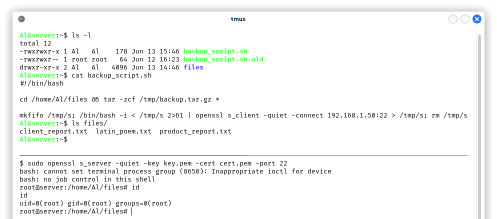
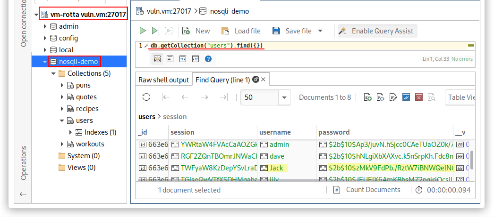
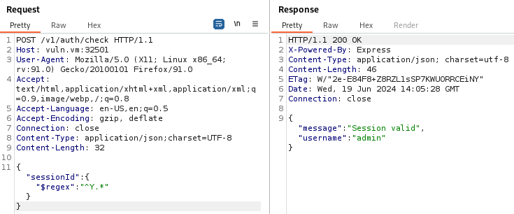

# Attacking a Randomly Assigned VM

## Group 1

**[Emanuele 'cats' Gatto](https://it.linkedin.com/in/emanuele-gatto-0a0a2b243)** and I completed this laboratory assignment. 

A big shout out to the authors of the fun VM we attacked and who let us publish this work, the **Group 25**:
- **[Andrea Fede](https://it.linkedin.com/in/andreafede)**
- **[Pietro Colaguori](https://it.linkedin.com/in/pietro-colaguori)**
- **[Chiara Iannicelli](https://it.linkedin.com/in/chiara-iannicelli)**
- **[Riccardo Tuzzolino](https://it.linkedin.com/in/riccardo-tuzzolino)**

## Requirements

**Penetration Testing**: Each group will be randomly assigned a VM designed by another group. Your objective is to identify and exploit vulnerabilities within this assigned VM to achieve the following:
- **Gain Local Access**: Establish initial access to the operating system on the VM.
- **Escalate Privileges**: Gain root privileges on the VM, allowing complete control of the system.

The pentester will start with no access to the target VM (i.e., they can reach the VM through the network but has no credentials to access any service on the machine). The pentester will have to scan and enumerate the system to find a way to obtain local access.  Once the pentester obtains local access, they must find a way to escalate privileges and obtain root access. After obtaining root privileges, the pentester must establish a way to maintain persistent access to the system (for instance, in case the vulnerable service is patched in the future) and clean traces of his actions in the VM.  **You should also discuss how you set up persistent access and how you cleaned your traces.** 

How well did you clean up after yourself? Did you leave traces? How did you maintain persistent access, and how easy is it to spot?

# VM Fullpwn

## Exploitation paths

This is a graph of the exploitation paths, it will be much clearer after reading the details in the next sections. Use it as reference.

We started our activity by port scanning with `nmap` the vulnerable machine. We found the following open ports and services (not showing RPC *nlockmgr* and *mountd* to shorten the output):

| **Port**  | **Service**                       | 
|-----------|-----------------------------------|
| 22/tcp    | OpenSSH 8.2p1 Ubuntu 4ubuntu0.11  |
| 80/tcp    | Apache httpd 2.4.41               |
| 111/tcp   | Portmapper (rpcbind)              |
| 2049/tcp  | Network File System               |
| 3000/tcp  | http (Grafana)                    |
| 3306/tcp  | MySQL 8.0.36-0ubuntu0.20.04.1     |
| 12345/tcp | *Custom protocol*                 |
| 27017/tcp | MongoDB 4.4.29                    |
| 32501/tcp | http (Node.js Express Middleware) |

## Easy exploitation path

### Initial steps

We started targeting the web applications, when visiting the one running on port 80 we found a useless page:

{: width="600"}

We know that this page is useless because there are few HTML elements, a CSS file and a form that makes a GET request which does not seem to be handled server-side, the query string is ignored. We looked for information leakage on comments, we performed some directory/file enumeration and found nothing. We tried a ping back blind XSS payload in the parameters of the form and got nothing. This looked like a meme application, so we moved to the next one. *We could have avoided these noisy actions if we looked to the NFS protocol first! This will serve as a lesson for us! It will be clear shortly.*

The second web application we looked at was running on port 3000. It was a Grafana instance that disclosed its version on the login page: **v8.2.0 (d7f71e9eae)**. We immediately searched the web for known vulnerabilities and found **CVE-2021-43798**[[1]](#references){: .footnote}, an Arbitrary File Read via Path Traversal in the context of the `grafana` system user. This vulnerability will be used more in the medium exploitation path, however, it was useful to read `/etc/passwd`{:.filepath} and `/etc/exports`{:.filepath} to enumerate users and the NFS ACL:

{: width="700"}

We found the users `Al` (UID: 1984), `John` (1985) and `Jack` (1986), a clear reference to the legendary trio of italian comedians! 

{: width="700"}

We found that the NFS is sharing the Apache httpd default directory with read and write permissions, now the web application on port 80 is more interesting!

### Foothold: Abusing NFS to upload a PHP webshell

"A notable aspect of the NFS protocol is its lack of built-in authentication or authorization mechanisms. Instead, authorization relies on file system information, with the server tasked with accurately translating client-provided user information into the file system's required authorization format, primarily following UNIX syntax. Authentication commonly relies on UNIX UID / GID identifiers and group memberships."[[2]](#references){: .footnote}

We started by running a `nmap` script called `nfs-ls` that shows the permissions and UID / GID needed to use the shared resource:

{: width="650"}

#### Uploading a PHP webshell

Thanks to the Grafana AFR vulnerability, we also know the name of the user with UID 1984, the user `Al`. This is irrelevant for the exploitation, but usernames are easier to remember than UIDs; let's access the resource and evaluate what we can do:

{: width="650"}

In the context of the user `Al` we can create new files inside the `/var/www/html`{:.filepath} directory. We decided to upload an obfuscated PHP webshell named `about.php`{:.filepath}:

{: width="650"}

We know that the target OS has `nc` which does not support the `-e` option and that `socat` is not installed by default, in fact, `whereis socat` returned nothing, so we decided to run a bash reverse shell leveraging `curl`:

{: width="650"}

#### User level persistence, deletion of artifacts and encrypted communication

The first thing we did was checking if the user `Al` already had a SSH key, but unfortunately we had to create one for persistence and to have an encrypted communication with the machine:

- `ssh-keygen`, to generate the key pair
- `echo $(cat ~/.ssh/id_rsa.pub) > ~/.ssh/authorized_keys`, to allow the access with the generated private key
- `cat ~/.ssh/id_rsa`, to copy the private key to the attacking machine, filename `id_rsa_Al`{:.filepath}
- `chmod 600 id_rsa_Al`
- `ssh -i id_rsa_Al Al@vuln.vm`

After the generation of the SSH key, we removed the PHP webshell we just uploaded.

### Privesc #1 via tar and wildcard expansion

The first command we run after connecting with SSH was `sudo -l`, used to check if there are some programs that can be run as root without submitting the password. We found that there is a cronjob that runs every minute and that is probably executed by root, since the first script is in his/her home:

{: width="700"}

The `backup_script.sh`{:.filepath} is owned by root and the user `Al` cannot directly modify it (more about this in the *[second method for privilege escalation](#privesc-2-via-a-new-backup_scriptsh)*), but we can see that it creates a `backup.tar.gz`{:.filepath} file in `/tmp/`{:.filepath} adding the files that are found inside the `/home/Al/files`{:.filepath} directory. However the programmer didn't think about the fact that by running `tar` with the wildcard `*` that way, he/she is allowing a malicious user to add options for the `tar` command that can alter the behavior of the utility! In this case, `tar` has some options that enable command execution:

- `--checkpoint=1`, and
- `--checkpoint-action=exec=COMMAND`

So we added two files with `touch -- "--checkpoint=1"` and `touch -- "--checkpoint-action=exec=bash rev"` where, again, `rev` contains a bash script of a reverse shell. We waited for a minute and then the `rev` file was removed from `/home/Al/files`{:.filepath}! This means that the `security_check.sh`{:.filepath} script removes all the files which contain patterns of a reverse shell. 

We then renamed the file `"--checkpoint-action=exec=bash rev"` to `"--checkpoint-action=exec=bash stage"`, created a `stage` shell script that does not directly execute a reverse shell, but it just runs the real `rev` script in `/home/Al`{:.filepath}:

{: width="800"}

Of course, we use the encryption and connect to a common encrypted port to not raise any suspicions. Our next step was the quick deletion of all the artifacts used to perform the privilege escalation and the generation of a SSH key to have `root` level persistence.

If the programmer used the secure script `cd /home/Al/files && tar -zcf /tmp/backup.tar.gz -- *`, then he would have avoided this first method for privilege escalation, but not the second one!

### Privesc #2 via a new backup_script.sh 

As we mentioned previously, the user `Al` is not allowed to directly modify the content of `backup_script.sh`{:.filepath} because the file is owned by `root`:

{: width="500"}

However, the user `Al` has write access to his home, where `backup_script.sh`{:.filepath} is stored. This means that `Al` can alter the integrity of the directory, i.e. he can rename, create and delete files! The simplest way to perform a privilege escalation is by renaming `backup_script.sh`{:.filepath} to `backup_script.sh.old`{:.filepath}, create a new `backup_script.sh`{:.filepath} which is owned by `Al` and can be edited to contain a reverse shell that will be run by the `root` user every minute:

{: width="800"}

Now that we have `root`, we quickly restore the content of `Al`'s home directory to avoid any suspicions.

#### Clearing traces

As mentioned in the *[initial steps paragraph](#initial-steps)*, we made a lot of noise when performing the directory/file enumeration on the web application running on port 80, so now that we are `root` we can clear the `Apache2` logs with `cat /dev/null > /var/log/apache2/*`. If all the operations were performed on the same day, we could have just cleared `access.log`{:.filepath} and `error.log`{:.filepath}.

The next thing we want to do is to clear the history of the `Al` user and avoid having the attacker IP on the `/var/log/auth.log`{:.filepath} when we disconnect from a SSH connection (it's easy to clear the log file when you are connected, but the record containing the IP is written after the user disconnects). We have a `root` SSH connection and we are running `tail -f /var/log/auth.log` to read the updated content in real time, this is the normal behavior and `192.168.1.50` is the attacker IP:

{: width="800"}
_The attacker IP is written to the `auth.log`{:.filepath} when establishing the connection and when disconnecting_

The following is the method we used to avoid the IP leak on the log file when disconnecting from the SSH connection:

{: width="800"}
_The attacker IP is not written to the `auth.log`{:.filepath} when disconnecting, but only when establishing the connection_

With the above command run by `Al` we disconnect from SSH without leaking the IP and we clear the bash history. We clearly still have the attacker's IP address on the log file, so let's do the same with the `root` account.

{: width="800"}
_Here we also clear the `auth.log`{:.filepath}_

We also make sure that the `/var/log/auth.log`{:.filepath} is cleared before exiting. To have the attacker's IP in the logs for the least amount of time possible, as soon as we connect we could run `cat /dev/null > /var/log/auth.log`. To be more stealthy, we could also manually delete the single log records.

We also decided to clear all the systemd logs and then restore the configuration:

{: width="600"}

By doing so we are completely hiding our actions, but at the same time we are creating some IoC (indicators of compromise) that can be spotted if and only if there is an active monitoring of the logs. A stealthier approach would have been to just delete the records that contain suspicious activities, for example the removal of the requests that run commands on `about.php`{:.filepath} in the `access.log`{:.filepath} or prepending a space to every command run on the shell, so that they don't get saved in the history by default thanks to `HISTCONTROL=ignoreboth`, which is equal to `ignoredups:ignorespace`:

{: width="350"}

By doing so we can avoid deleting the entire bash history. *It is way better to not leave traces than to delete them after!*

When using SSH, the attacker IP is also stored in `/var/log/wtmp`{:.filepath} (successful logins), `/var/log/btmp`{:.filepath} (failed logins) and `/var/log/lastlog`{:.filepath} (most recent login), so we can alter or clear the content with the `root` user: `echo > /var/log/lastlog`, `echo > /var/log/wtmp` and `echo > /var/log/btmp`. This paranoia for the attacker IP is justified only because we are in a local network and we are not proxying our traffic. We wouldn't care so much if we had a proper network infrastructure that can hide our activities. 

*We are aware that all the deleted artifacts, logs and attacker IPs are still recoverable with Digital Forensics. For this Ethical Hacking exercise we are not overwriting the contents of these files properly.*

The other possible indicator of compromise is the creation of the files `--checkpoint=1`{:.filepath}, `--checkpoint=exec=bash stage`{:.filepath}, `stage`{:.filepath} that can raise suspicions in case the user visited the `/home/Al/files`{:.filepath} directory in the same **minute** we tried to perform the privilege escalation. 

## Medium exploitation path

### Foothold: CVE-2021-43798 Grafana v8.2.0 Arbitrary File Read via path traversal

We already talked about **CVE-2021-43798** in the *[Easy exploitation path](#easy-exploitation-path)* because it was used to enumerate users and the NFS ACL. This vulnerability also allows an attacker to read Grafana's active and default configurations, plus the `grafana.db`{:.filepath} SQLite database. We used a *publicly available exploit made by Pedro Havay*[[3]](#references){: .footnote} that extracts all the interesting files automatically, it performs the same HTTP requests we did manually to read `/etc/passwd`{:.filepath} or `/etc/exports`{:.filepath}:

{: width="800"}

The **Secret Key** is in plaintext and is found in the configuration file `grafana.ini`{:.filepath}, but it didn't turn out useful for the foothold. We now have the `grafana.db`{:.filepath} and the first thing we thought of was to gain access to the administrative account of the web application. The information is stored in the `user` table and the password is a SHA256 hash with salt:

{: width="650"}

We extracted the hash in a format suitable for `hashcat` and run `hashcat -a 0 -m 10900 hash.txt /usr/share/wordlists/rockyou.txt`:

{: width="650"}

Unfortunately, we couldn't get the administrative password. We continued to explore the SQLite database and we found that the `data_source` table contained the plaintext password for a MySQL user:

{: width="650"}

We connected to MySQL with user `grafana`, password `dontCryOverSpilledMilk456?` and we found an interesting database called `funkyfeature`:

{: width="650"}

We looked into it and we found the user `John` with his bcrypt hash which we were able to crack with `hashcat`:

{: width="650"}
{: width="650"}

We have user level persistence, as long as `John` doesn't change password. We can generate a new SSH key for a more reliable access.

### Privesc: Git information leak and privilege escalation via consul service

As soon as we logged in as `John` with SSH, we looked at his home directory and we had the right intuition, looking for Git commits to find potentially useful informations for the privilege escalation:

{: width="650"}

By having a look at the `git log`, we found that the developers added a config script and then they edited it in the next commit, maybe because they leaked some private information...

{: width="650"}
{: width="650"}

We now have a **consul token**, but since we never used `consul` before, we had to go through a lot of documentation to understand its features, inner-workings and APIs. We noticed that the `consul` service is run by `root`, so we were definitely on the right path. Tokens and policies are used for authentication, authorization and our token can be used for all the features of the utility, which means it is an administrative one:

{: width="800"}

We can now add a service that executes a system command, we will execute `/bin/bash /tmp/health-check.sh`, a script that removes the malicious consul service, runs an encrypted reverse shell and also deletes the temporary file. We added and removed the service via the APIs instead of the `consul` utility:

{: width="800"}

As you can see, we got `root`! Now we can generate a SSH key, close the reverse shell session and start clearing the traces.

#### Clearing traces

For this medium exploitation path we used **Grafana** and **Consul**. We spent some time searching the web for default paths of log files, we run `ps -aux | grep grafana` and `ps -aux | grep consul` to see their *cmdline*, we looked at their systemd startup scripts and we only found:

- `/var/log/grafana/grafana.log`{:.filepath}
- `journalctl -u grafana-server.service`{:.filepath}
- `journalctl -u consul`{:.filepath}

Grafana was configured to use the above log file, but it didn't contain anything that could track our malicious activities. All the dangerous logs from an operational security point of view are found in the systemd journal. Here is an excerpt of the `grafana-server.service` journal output, e.g. some files that the exploit tried to read:

{: width="800"}

On the other hand, consul was not configured to use logs at all and, in this case, the journal just contains a few records which tells that the service `health-check` was executed. 

We can delete all the systemd logs like in the *[Easy exploitation path](#clearing-traces)*. 

## Hard exploitation path

We have explored most of the services running on the virtual machine, now it's time for MongoDB, the custom service on port 12345 and the Node.js app!

### Foothold #1: Uprotected access to MongoDB

When performing the `nmap` scan with the default scripts (`-sC`) we saw that we were able to get a lot of informations on the database! This is the output of the `mongodb_databases` script:

{: width="550"}

So, we tried to connect to the MongoDB service with *Studio3T*[[4]](#references){: .footnote} without credentials:

{: width="800"}

We already know from the *Easy exploitation path* that there is a user called `Jack` in the machine and we can find a bcrypt hash of his password in MongoDB. We can crack it with `haschcat -a 0 -m 3200 jack_hash.txt /usr/share/wordlists/rockyou.txt` and access the machine through SSH. The password is `babygirl1`.

Since this is clearly an unintended misconfiguration, we are going to explore the Node.js app which is probably using MongoDB. The name of the database `nosqli-demo` confused us a little bit because we were mainly looking for NoSQL injections (spoiler, we found one), but the vulnerability that allows a malicious user to get the hash of the user `Jack` is a Server-Side Request Forgery (SSRF)!

### Foothold #2: Server-Side Request Forgery (SSRF)

The Node.js application **"The Fitness Bro"** running on port 32501 was a Swagger UI containing the documentation for some API endpoints. Other than registration and login, the application allowed users to read motivational quotes and add / edit workout exercises. The admin user was able to read the workouts of all the users and there were at least two other internal APIs that were only usable by **localhost** or **127.0.0.1**.

When adding a new workout or editing an existing one, the user is able to specify a `source`, probably used to extend other public workouts by adding some exercises. On the right we can see the request we can make to edit a workout:

{: width="800"}

We registered a new user **b0g3c4ts** with password **test** and we used the session token to create a new workout without a `source`. Next, we made the following request `GET /v1/workouts` to find the ID of an interesting workout to use as a source:

{: width="750"}
_Workout ID that ends in 486 is the one we will use as source_

Then we edited our own workout to include the above workout as a `source`. In the link, we can use both **192.168.1.157** and **127.0.0.1**. Let's see the normal behavior:

{: width="750"}
_Everytime we say "we edited the source", it means that we perform the above PUT request and we change the 'source' parameter in the body_
{: width="750"}
_For some reason the exercises are gone. Well, this web app is supposed to be broken after all :)_

Now we want to set as source **Obi-Wan Kenobi** from a *public Star Wars API*[[5]](#references){: .footnote} using the link `https://swapi.dev/api/people/10/?format=json`, (this is actually in line with the fitness application, he once said *"May the force be with you"*). We repeat the same PUT request as before, we just change the `source` link, here is the result:

{: width="750"}

It worked, this confirms the presence of a Server-Side Request Forgery. In the home of the web application we can see that it is possible to perform the following HTTP request if and only if we have local access to the server: `GET /v1/data/internal/:action`. In the sample data we can see that a possible action is `uptime`:

{: width="750"}

However, it seems like we need to have the loopback IP address to fetch the results of the HTTP request. We tried to bypass this restriction by changing the `Host: 127.0.0.1:32501` header, adding `X-Forwarded-For: 127.0.0.1`, `X-Client-IP: 127.0.0.1` and many other common ones, but none of this worked. Then we used the SSRF to see the results of the internal API endpoint, i.e. we edited the source of the workout to `http://127.0.0.1:32501/v1/data/internal/uptime`:

{: width="750"}

As we can see, this is the output of the Unix `uptime` command. Since the API documentation uses `:action` and not just `uptime`, we tried to use other system commands, like `ls`, `pwd`, but none of them worked. The server always returned a `null` in the `sourceWorkout`. In the end, we tried some possible other internal endpoints by editing the *SecLists api-endpoint.txt wordlist*[[6]](#references){: .footnote}, we just want to set the last part of the HTTP request path:

{: width="500"}

After sorting and removing duplicates, we have a list of 198 api endpoints to test. We wrote the following python exploit:

{: width="550"}

1. In the first part we load the API endpoints in a list
2. In the second part, for each API endpoint we do a PUT HTTP request to change the `source` workout link, leveraging the SSRF vulnerability
3. In the last part, if the source is not `null`, we found a new internal API endpoint. 

In the next screenshot it is possible to see the exploit in action, we were able to find the undocumented internal API endpoint `/v1/data/internal/users`{:.filepath} and we got `Jack`'s bcrypt hash:

{: width="750"}
{: width="750"}

### Privesc #1: ret2win

After logging in as `Jack` via SSH we found a root-owned binary named `shell` with its C source code. 

The `main()` function opens the `/opt/sensitive/cred`{:.filepath} file in read-only mode and copies a maximum of `MAX_PASSWORD_LENGTH` (30) bytes of content into the `password` buffer with the `fgets()` function. Then it closes the file, replaces the `\n` read from the file with a `\x00` byte in the `password` buffer, a good practice, and then calls the `compare_passwords()` function. Here, the `password` buffer can contain up to `MAX_PASSWORD_LENGTH` bytes, so nothing bad should happen.

Of course, the file `/opt/sensitive/cred`{:.filepath} is not readable by `Jack`.

{: width="600"}

The function `compare_passwords()` creates a new `buffer` with size `MAX_PASSWORD_LENGTH` and uses the `gets()` function to write on it, thus allowing the user to write the entire `buffer` and to continue overwriting the stack! We have a **stack-based buffer overflow**. Next, the code uses the `strcmp()` function to check if the two passwords are equal. If they are, it calls the `spawn_shell()` function, our *"win"* function (using the CTF jargon), otherwise it prints a string and returns to `main()`.

{: width="600"}

First of all, let's see what kind of binary this is and what protections are in place (we downloaded the binary on the attacker machine):

{: width="700"}

This is going to be pretty easy! We have the NX bit, so the stack is not executable, but we are going to write the standard **ret2win** exploit in which we simply overwrite the return address with the address of the `spawn_shell()` function, there is no need to write a shellcode. We also have ASLR enabled by default, but we don't care.

Let's see the memory layout with IDA's Stack View:

{: width="700"}

In a normal execution, when `Jack` tries to guess the password, he fails, the string **"Password incorrect"** is printed, as you can see from the assembly `call _puts` at `0x401318`, then the CPU will execute the epilogue of the `compare_passwords()` function, restoring the `main()` stack frame and resuming the execution after the `compare_passwords()` call at `0x4013EB`. This happens because in the stack, the return address is `0x4013F0` in `main()`.

{: width="700"}

Thanks to the buffer overflow, we can write a total of 48 bytes in the stack, filling the **30** bytes of `buffer`, two extra bytes because 30 is not a multiple of 8 and then **8** bytes to overwrite the old base pointer. We have written 40 bytes of padding to reach the **return address**, which we will overwrite with the address of `spawn_shell()`.

Let's see the exploit with the address of `spawn_shell()` that we have to write with respect to the endianness of the architecture:

{: width="700"}
{: width="450"}

We get the **"Pasword incorrect"** string, but since we overwrote the return address, the RIP register will not point to `mov eax, 0` that prepares for the `return 0` in `main()`, but it will point to the start of the `spawn_shell()` function, giving us a root shell!

### Privesc #2: r00t by mistake :)

The user doesn't even need to know what a buffer overflow is to get a root shell:

{: width="500"}

The reason is pretty simple. If we look at the `objdump -M intel -d shell` output or the IDA Text View, we can see that the normal return address is `0x4013F0`:

{: width="650"}

But the instruction at `0x40130a` is a `call spawn_shell` in `compare_passwords()`, which means that if the user writes 40 bytes and then press "Enter" on the keyboard, a new line feed character, or `\n`, or `0x0a` in hexadecimal gets added, thus overwriting the least significant byte of the return address in little endian and getting a r00t shell:

{: width="700"}

### Privesc #3: root via a new shell executable

The third way we can get a root shell is by renaming the `shell` executable owned by `root` and create a new one that runs a reverse shell. This is the same unintented method used with the `Al` user for the `backup_script.sh`. Since `Jack` has write privileges on his home, he can alter the integrity of the directory. In order to make the new `shell` executable work, we have to open a connection to port 12345, such that the new program gets executed by the root user:

{: width="700"}

We are not going to explain again how this work, it's equivalent to the *[second privesc of the easy exploitation path](#privesc-2-via-a-new-backup_scriptsh)*. After getting the root shell, we proceed by restoring the contents of `Jack`'s home directory.

#### Clearing traces

For this exploitation path we used **MongoDB**, **Node.js** and the custom binary running on port 12345. Both MongoDB and Node.js are in docker containers, so we should find where they are started and if they are configured to store logs. The two containers are started from `/opt/the-fitness-bro/`{:.filepath} and in the docker volumes we didn't find log files. So the only logs we should pay attention to are the `docker logs` of the Node.js app:

{: width="700"}

1. In the first part of the screenshot you can see an output excerpt of the `docker logs ff7` command, where `ff7` are the initial characters of the container identifier. As you can see, we have a JSON log of the last HTTP request made by the webserver to fetch the source of our workout, i.e. the source is the last API endpoint tested by our exploit.
2. In the second part of the screenshot we clear the `docker logs` of the web app with the `truncate -s 0 /path/to/logfile` command. Then we rerun the `docker logs ff7` command to see if the previous command was successful.

In the end, the custom binary on port 12345 was not logging anything. Again, a more stealthier approach would have been to just remove the malicious requests from the logfile instead of clearing it completely.

A last note for the **Clearing traces** sections, we also checked if there were some `iptables` logging rules and we didn't find any. Of course, since we are the only users of the virtual machine, the IoC of the log clearing is quite obvious, but imagine if there were multiple users using the same services... logs would have been repopulated quite fast and you would need someone / something actively checking the logs to find out that something suspicious was happening.

The unintended vulnerabilities that exploits the creation of new files in home directories were exploited just for the report, we don't consider them as IoCs because we didn't use them initially. 

## Beyond root

### Other vulnerabilities

#### Username enumeration thanks to error messages

In the Node.js application it is possible to enumerate the users thanks to the error messages on the response to `POST /v1/auth/login`. When the `username` does not exist and the `password` is not a string, the error message is **"Invalid username or password"**, a good error message that does not specify what went wrong:

{: width="700"}

On the other hand, when the `username` exists and the `password` is not a string, the error message is **"Error comparing passwords"**, indicating that the username was correct but the password was not:

{: width="700"}

Plus, the user has unlimited login attempts, allowing bruteforce attacks. This is, of course, an unintended vulnerability, the focus of the authors of this VM was likely on the SSRF, but my job is to report everything :).

#### NoSQL Injection for session hijacking and username enumeration

In the Node.js app, the `POST /v1/auth/check` API checks if a `sessionId` is valid: if it's valid, the webserver returns a JSON containing a message **"Session valid"** and the `username` binded to that session.

{: width="700"}

Otherwise, the server returns the message **"Unauthorized"**:

{: width="700"}

By playing with the `sessionId` POST parameter we found that it is vulnerable to NoSQL Injection: we can replace the `sessionId` value with an object that uses the MongoDB `$regex` to find all the active `sessionIds`, obtaining also the `usernames` and bypassing the authentication.

{: width="700"}

This works because `sessionIds` are stored in the database and, probably, the backend is doing a query similar to `db.users.findOne({sessionId: req.body.sessionId})` (pseudocode), i.e. it is using the user input directly in the MongoDB query. We don't think storing `sessionIds` in the database is a good practice, the devs are violating the principle of separation between data and applications (remember that this is a VM and the goal was not to create a perfectly functioning real application). 

We wrote a python exploit that extracts all the sessions with their relative username:

{: width="700"}

The exploit performs an efficient bruteforce of the characters for a `sessionId`, it uses a `queue` to progressively store all the valid prefixes of `sessionIds` and the  `valid_sessions` dictionary that stores the current longest `sessionId` string for each `username`. We needed a queue because it is possible to have multiple `sessionIds` that start with the same letters and continue with different ones, so it is more efficient to continue the search from valid prefixes, adding them to the queue as soon as they are discovered, instead of repeating the tests of previous characters. 

> We could have used a persistent TCP connection to make it more efficient. 
{: .prompt-info }

A `sessionId` regex pattern is added to the queue if and only if the response to the POST request using the current pattern plus the $i$-th character of the alphabet contains the **"Session valid"** message. This way we consume the current pattern, then we find and add to the queue all the valid continuations. In the end, the queue is empty and the `valid_sessions` dictionary contains all the user `sessionIds`.

{: width="700"}

We can now use the valid session of the `admin` user to access the administrative API, without knowing his/her password. This is cool, but unfortunately we don't have access to new / interesting / private features, so this is not useful for the foothold. We were not able to do the same attack to fetch the bcrypt hashes of the passwords because we cannot add other attributes or logical operators in this specific scenario.

## More on post-exploitation activities

### Linux Kernel Module (LKM) rootkit

LKM rootkits are widely used by APTs to maintain persistency and to be as stealthy as possible. Loadable kernel modules are pieces of code that can be dynamically loaded into the Linux kernel to extend its functionality without the need to recompile the kernel or even reboot. We are not going in the details on how they work because we are still studying them for our own curiosity and also because this is out of the scope of the course.

We used an open source LKM rootkit called *Reptile*[[7]](#references){: .footnote} which leverages **Kernel Probes**.

This rootkit has several features, but most importantly, it hides its presence, in fact we can't find the kernel module with the `lsmod` command. Plus all the connections with the attacker machine are hidden, the local users can become root at any time by running the `/reptile/reptile_cmd root` command. Every file, directory that contains `reptile` in the name are hidden to every user. Inside any file it is possible to add content between `#<reptile>` and `#</reptile>`: this part will also be hidden! 

We used a well known rootkit, therefore there are automatic tools publicly available that can detect it, but you would never think of it if you never saw something suspicious, right? Seeing a rootkit in action is something scary and fascinating at the same time!

In general, finding a rootkit is something pretty hard also for incident response professionals, so we think this persistence method is very stealthy and powerful. Do you need anything else? Like, seriously.

{: width="700"}

## References

1. CVE-2021-43798 Grafana v8.2.0 Arbitrary File Read: [https://nvd.nist.gov/vuln/detail/CVE-2021-43798](https://nvd.nist.gov/vuln/detail/CVE-2021-43798)
2. HackTricks NFS Pentesting: [https://book.hacktricks.xyz/network-services-pentesting/nfs-service-pentesting](https://book.hacktricks.xyz/network-services-pentesting/nfs-service-pentesting)
3. CVE-2021-43798 exploit by Pedro Havay: [https://github.com/pedrohavay/exploit-grafana-CVE-2021-43798/blob/main/exploit.py](https://github.com/pedrohavay/exploit-grafana-CVE-2021-43798/blob/main/exploit.py)
4. Studio3T MongoDB client: [https://studio3t.com/](https://studio3t.com/)
5. Star Wars API: [https://swapi.dev/](https://swapi.dev/)
6. SecLists api-endpoints.txt wordlist: [https://github.com/danielmiessler/SecLists/blob/master/Discovery/Web-Content/api/api-endpoints.txt](https://github.com/danielmiessler/SecLists/blob/master/Discovery/Web-Content/api/api-endpoints.txt)
7. Reptile LKM rootkit: [https://github.com/f0rb1dd3n/Reptile](https://github.com/f0rb1dd3n/Reptile)
